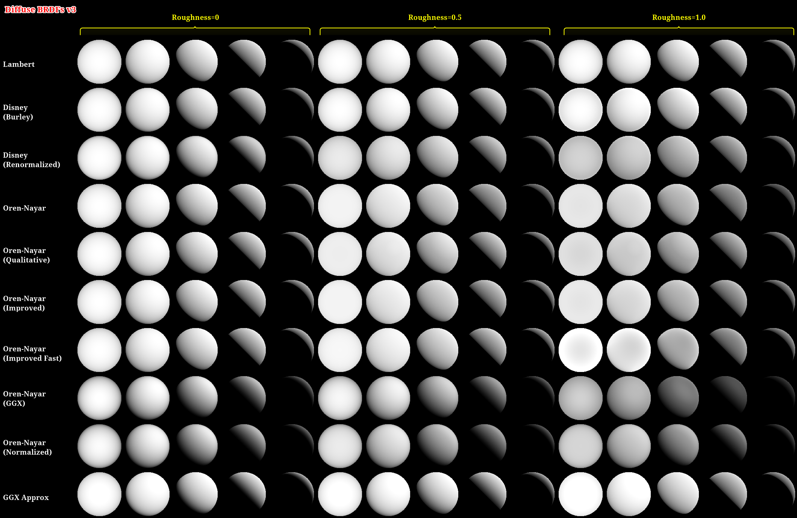
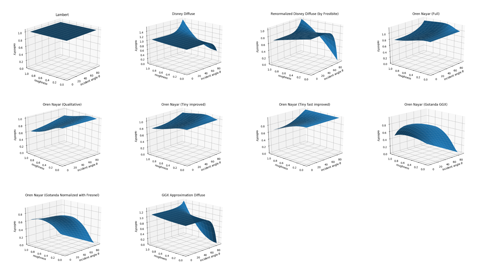
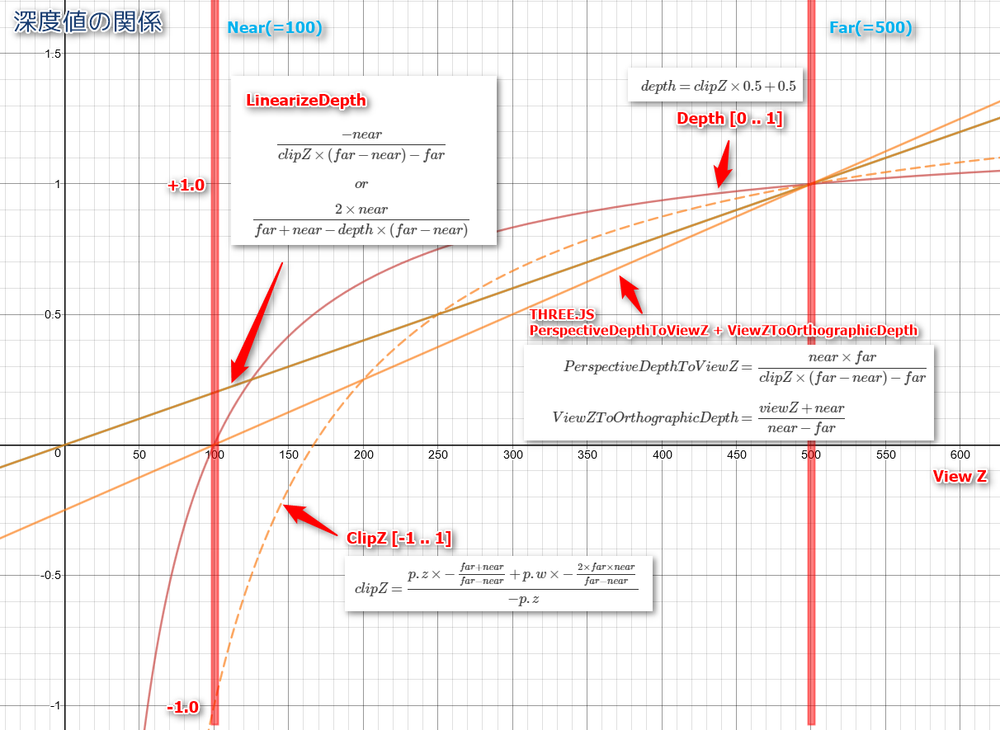
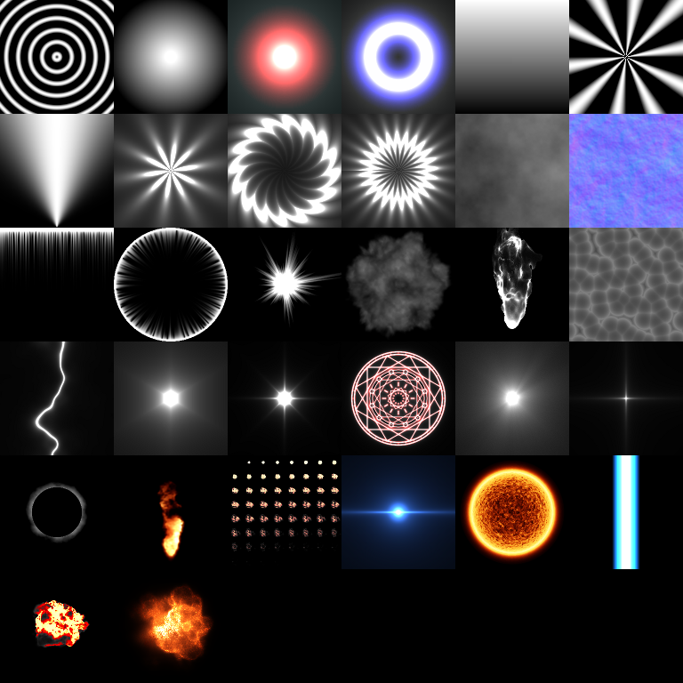
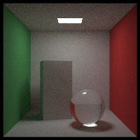

# Publications

## Articles (PDF)

 [docs - https://github.com/mebiusbox/docs](https://github.com/mebiusbox/docs)

## Articles (Qiita)

- [Basic of Physically-based Rendering (Japanese)](https://qiita.com/mebiusbox2/items/e7063c5dfe1424e0d01a)
- [Basic of Physically-based Rendering(Implementation)(Japanese)](https://qiita.com/mebiusbox2/items/8a4734ab5b0854528789)
- [Diffuse BRDF (Japanese)](https://qiita.com/mebiusbox2/items/1cd65993ffb546822213)
- [Specular BRDF (Japanese)](https://qiita.com/mebiusbox2/items/8db00cdcaf263992a5ce)
- [Raytracing vol.1 "Ray and Reflection" (Japanese)](https://qiita.com/mebiusbox2/items/89e2db3b24e4c39502fe)
- [Raytracing vol.2 "Texture and Cornel Box" (Japanese)](https://qiita.com/mebiusbox2/items/33421b49c05df0b95fb0)
- [Raytracing vol.3 "Monte Carlo Raytracing" (Japanese)](https://qiita.com/mebiusbox2/items/5a388ef4d5089568a529)
- [Probability and Statistics for Computer Graphics (Japanese)](https://qiita.com/mebiusbox2/items/1b69ccf5d76b173350e5)
- [Probability for Computer Graphics #1 (Japanese)](https://qiita.com/mebiusbox2/items/bc1a150b8f5789e5e0d5)
- [Probability for Computer Graphics #2 (Japanese)](https://qiita.com/mebiusbox2/items/3852324532bd3ca88351)
- [A primer of Linear Algebra for Computer Graphics -Vector- (Japanese)](https://qiita.com/mebiusbox2/items/172131bf95da172d1371)
- [A primer of Linear Algebra for Computer Graphics -Matrix- (Japanese)](https://qiita.com/mebiusbox2/items/5941801416e8a6993851)
- [A primer of Linear Algebra for Computer Graphics -Determinant- (Japanese)](https://qiita.com/mebiusbox2/items/191dcbead5d927f9b557)
- [A primer of Fourier Transform -Fourier series- (Japanese)](https://qiita.com/mebiusbox2/items/657df6e458d85303e50d)
- [Quaternion for Computer Graphics (Japanese)](https://qiita.com/mebiusbox2/items/2fa0f0a9ca1cf2044e82)
- [glTF note (Japanese)](https://qiita.com/mebiusbox2/items/c6b1c1f401a8df8df552)
- [Check UTF-8BOM with Hook Script of Git (Windows) (Japanese)](https://qiita.com/mebiusbox2/items/a1092b7bdd4af50e4bc9)
- [How to use markdown (Japanese)](https://qiita.com/mebiusbox2/items/7341b13579133dc6b018)
- [Generating document with MkDocs (Japanese)](https://qiita.com/mebiusbox2/items/a61d42878266af969e3c)

## Images

(Click on the image, it will be displayed in the actual size)

### Diffuse BRDF v3

### Diffuse BRDF Plot v1

Source code: [brdf_plot](https://github.com/mebiusbox/brdf_plot)

### Relationship of depth value (Three.js)

## pixy.js

My shader and utility library for three.js.

### Features

- PBR(Diffuse: Lambert or Oren-Nayar, Specular: Cook-Torrance)
- Deferred Shading (use three.js custom version)

### Examples

- [Phong Shading](http://mebiusbox.github.io/contents/pixyjs/samples/shader_phong.html)
- [Texture Mapping](http://mebiusbox.github.io/contents/pixyjs/samples/shader_texture.html)
- [Glass](http://mebiusbox.github.io/contents/pixyjs/samples/shader_glass.html)
- [Fog, RimLight, Light Map](http://mebiusbox.github.io/contents/pixyjs/samples/shader_fog.html)
- [Displacement Map, Inner Glow, Line Glow](http://mebiusbox.github.io/contents/pixyjs/samples/shader_displacement.html)
- [UV Projection](http://mebiusbox.github.io/contents/pixyjs/samples/shader_projection.html)
- [Velvet, Distortion, UV Scroll](http://mebiusbox.github.io/contents/pixyjs/samples/shader_velvet.html)
- [Scattering, Ocean](http://mebiusbox.github.io/contents/pixyjs/samples/shader_sky.html)
- [PBR (based on UE4, Oren-Nayar)](http://mebiusbox.github.io/contents/pixyjs/samples/shader_standard.html)
- [Overlay](http://mebiusbox.github.io/contents/pixyjs/samples/shader_overlay.html)
- [Grass, Shadowed, Instance](http://mebiusbox.github.io/contents/pixyjs/samples/shader_grass.html)
- [Deferred, Bloom, Tone Mapping](http://mebiusbox.github.io/contents/pixyjs/samples/shader_standard.html)
- [Sphere Area Light (roughness hack)](http://mebiusbox.github.io/contents/pixyjs/samples/shader_area_light_hack.html)
- [Tube Area Light (roughness hack)](http://mebiusbox.github.io/contents/pixyjs/samples/shader_tube_light_hack.html)
- [Area Light](http://mebiusbox.github.io/contents/pixyjs/samples/shader_area_light.html)
- [Projected Shadow](http://mebiusbox.github.io/contents/pixyjs/samples/shadow_mesh.html)
- [Parallax, Distortion](http://mebiusbox.github.io/contents/pixyjs/samples/shader_parallax.html)
- [Soft, GPU Particle](http://mebiusbox.github.io/contents/pixyjs/samples/softparticle.html)

## EffectTextureMaker

[EffectTextureMaker](http://mebiusbox.github.io/contents/EffectTextureMaker/) is generating texture tool on the web browser. This tool you can make a lot of vfx textures and you can also make animated sprites sheet. [more](http://mebiusbox.github.io/software/2017/01/06/EffectTextureMaker.html)

The texture generated with EffectTextureMaker that you would like to make available free for commercial and non-commercial use.

### Features

- A lot of type of template for vfx texture.
- Make a normal map.
- Make a animated sprites sheet.
- You can save as image format supported by the web browser.
- Support image maximum of 2048 sizes.
- Support color balance adjustment.

## rayt

This is source code of my ray tracing articles.

 [rayt - https://github.com/mebiusbox/rayt](https://github.com/mebiusbox/rayt)

## pixyrt

A simple raytracing renderer in c++.

 [pixyrt - https://github.com/mebiusbox/pixyrt](https://github.com/mebiusbox/pixyrt)

## Links

### Rendering

- [The Research and Development Department in tri-Ace](http://research.tri-ace.com/)
- [LIBRARY | テクノロジー推進部 ADVANCED TECHNOLOGY DIVISION | SQUARE ENIX](http://www.jp.square-enix.com/tech/publications.html)
- [講演資料 | シリコンスタジオ](https://www.siliconstudio.co.jp/rd/presentations/)
- [CEDiL](https://cedil.cesa.or.jp/search)

### Texture

- [Compressonator](https://github.com/GPUOpen-Tools/Compressonator) : Tool suite for Texture and 3D Model Compression, Optimization and Analysis using CPUs, GPUs and APUs 
- [DirectXTex](https://github.com/Microsoft/DirectXTex) : DirectXTex texture processing library
- [dds_thumbnail](https://github.com/oteguro/dds_thumbnail) : DirectX 11のテクスチャ圧縮フォーマットBC1～BC7をサムネイル表示
- [DDS ファイルフォーマットの詳細解説](http://dench.flatlib.jp/ddsformat)
- [DDSファイルを自力で読んでみよう](http://techblog.sega.jp/entry/2016/12/26/100000)
- [DirectX 11の圧縮フォーマットBC1～BC7について（前編）](http://www.webtech.co.jp/blog/optpix_labs/format/6993/)
- [DirectX 11の圧縮フォーマットBC1～BC7について（後編）](http://www.webtech.co.jp/blog/optpix_labs/format/7006/)
- [DDS Susie Plugin](https://www.dropbox.com/s/njhn5ckk7r98gzr/ifDirectXTex.zip?dl=0) : BC1～BC7対応

### Book

- [フォトンマッピング](https://www.amazon.co.jp/dp/4274079503)
- [なるほど微積分](https://www.amazon.co.jp/dp/4875252005)
- [ゼロから学ぶ線形代数](https://www.amazon.co.jp/dp/4061546538/)
- [ゼロから学ぶ微分積分](https://www.amazon.co.jp/dp/406154652X/)
- [富田の英文読解１００の原則 上](https://www.amazon.co.jp/dp/4479190465/)
- [富田の英文読解１００の原則 下](https://www.amazon.co.jp/dp/4479190473/)