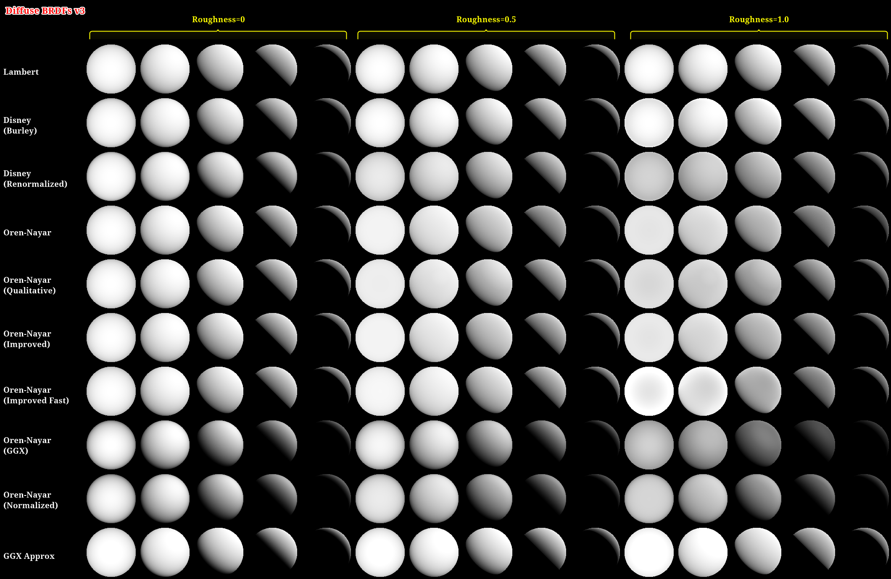
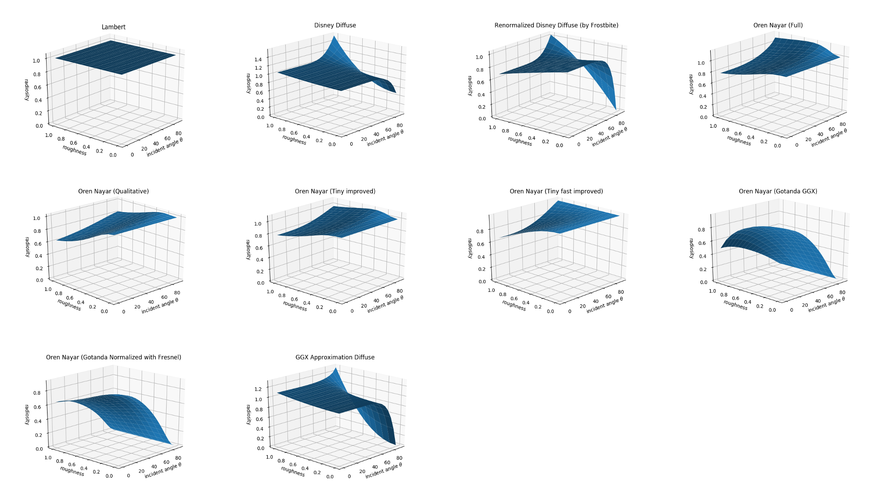
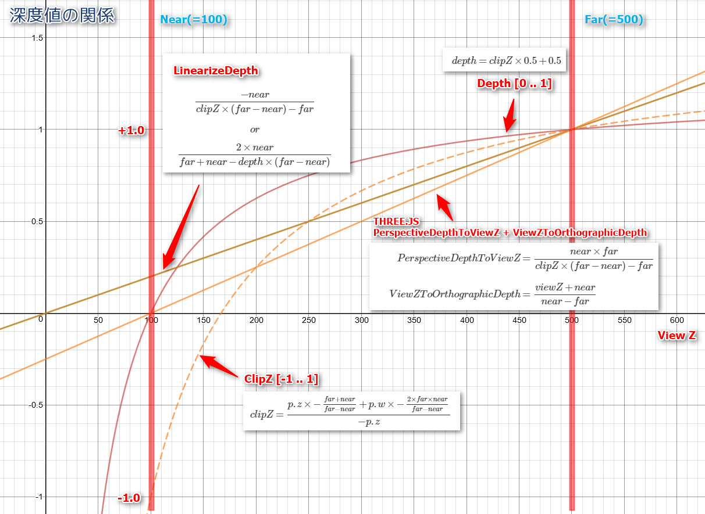
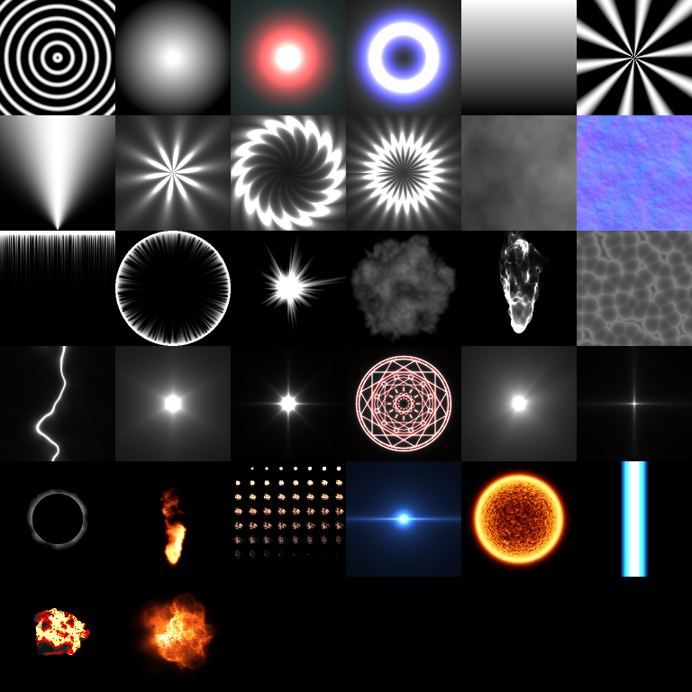

# 公開しているもの

## 書いたもの(PDF)

 [docs - https://github.com/mebiusbox/docs](https://github.com/mebiusbox/docs)

## 書いたもの(Qiita)

- [基礎からはじめる物理ベースレンダリング](https://qiita.com/mebiusbox2/items/e7063c5dfe1424e0d01a)
- [基礎からはじめる物理ベースレンダリング（実装編）](https://qiita.com/mebiusbox2/items/8a4734ab5b0854528789)
- [拡散BRDF](https://qiita.com/mebiusbox2/items/1cd65993ffb546822213)
- [鏡面BRDF](https://qiita.com/mebiusbox2/items/8db00cdcaf263992a5ce)
- [レイトレーシング入門１「光線の基本と反射」](https://qiita.com/mebiusbox2/items/89e2db3b24e4c39502fe)
- [レイトレーシング入門２「テクスチャとコーネルボックス」](https://qiita.com/mebiusbox2/items/33421b49c05df0b95fb0)
- [レイトレーシング入門３「モンテカルロレイトレーシング」](https://qiita.com/mebiusbox2/items/5a388ef4d5089568a529)
- [CGのための確率・統計入門](https://qiita.com/mebiusbox2/items/1b69ccf5d76b173350e5)
- [CGのための確率　前編](https://qiita.com/mebiusbox2/items/bc1a150b8f5789e5e0d5)
- [CGのための確率　後編](https://qiita.com/mebiusbox2/items/3852324532bd3ca88351)
- [CGのための線形代数入門　ベクトル編](https://qiita.com/mebiusbox2/items/172131bf95da172d1371)
- [CGのための線形代数入門　行列編](https://qiita.com/mebiusbox2/items/5941801416e8a6993851)
- [CGのための線形代数入門　行列式編](https://qiita.com/mebiusbox2/items/191dcbead5d927f9b557)
- [CGのためのフーリエ変換　フーリエ級数編](https://qiita.com/mebiusbox2/items/657df6e458d85303e50d)
- [CGのためのクォータニオン](https://qiita.com/mebiusbox2/items/2fa0f0a9ca1cf2044e82)
- [glTF覚え書き](https://qiita.com/mebiusbox2/items/c6b1c1f401a8df8df552)
- [GitのフックスクリプトでUTF-8BOMチェック(Windows)](https://qiita.com/mebiusbox2/items/a1092b7bdd4af50e4bc9)
- [Markdown活用法](https://qiita.com/mebiusbox2/items/7341b13579133dc6b018)
- [MkDocsによるドキュメント作成](https://qiita.com/mebiusbox2/items/a61d42878266af969e3c)

## 画像

画像をクリックすると，本サイズの大きさで表示されます．

### Diffuse BRDF v3

### Diffuse BRDF Plot v1

ソースコード：[brdf_plot](https://github.com/mebiusbox/brdf_plot)

### 深度値の関係 (Three.js)

## pixy.js

Three.js 用の独自シェーダとユーティリティライブラリです．

### 機能

- 物理ベースレンダリング（拡散反射：ランバート，オーレン・ナイヤー，鏡面反射：クック・トランス）
- ディファードシェーディング（three.js の MRT カスタムバージョンを使用）

### サンプル

- [フォン・シェーディング](http://mebiusbox.github.io/contents/pixyjs/samples/shader_phong.html)
- [テクスチャマッピング](http://mebiusbox.github.io/contents/pixyjs/samples/shader_texture.html)
- [ガラス](http://mebiusbox.github.io/contents/pixyjs/samples/shader_glass.html)
- [フォグ，リムライト，ライトマップ](http://mebiusbox.github.io/contents/pixyjs/samples/shader_fog.html)
- [ディスプレイスメントマップ，インナーグロー，ライングロー](http://mebiusbox.github.io/contents/pixyjs/samples/shader_displacement.html)
- [投影マッピング](http://mebiusbox.github.io/contents/pixyjs/samples/shader_projection.html)
- [ベルベット，歪み，ＵＶスクロール](http://mebiusbox.github.io/contents/pixyjs/samples/shader_velvet.html)
- [大気散乱，海](http://mebiusbox.github.io/contents/pixyjs/samples/shader_sky.html)
- [物理ベースレンダリング（ＵＥ４ベース，オーレン・ナイヤー）](http://mebiusbox.github.io/contents/pixyjs/samples/shader_standard.html)
- [オーバーレイ](http://mebiusbox.github.io/contents/pixyjs/samples/shader_overlay.html)
- [草，影，インスタンス](http://mebiusbox.github.io/contents/pixyjs/samples/shader_grass.html)
- [ディファード，ブルーム，トーンマッピング](http://mebiusbox.github.io/contents/pixyjs/samples/shader_standard.html)
- [球状エリアライト（ラフネスハック）](http://mebiusbox.github.io/contents/pixyjs/samples/shader_area_light_hack.html)
- [線状エリアライト（ラフネスハック）](http://mebiusbox.github.io/contents/pixyjs/samples/shader_tube_light_hack.html)
- [エリアライト](http://mebiusbox.github.io/contents/pixyjs/samples/shader_area_light.html)
- [投影シャドウ](http://mebiusbox.github.io/contents/pixyjs/samples/shadow_mesh.html)
- [視差，歪み](http://mebiusbox.github.io/contents/pixyjs/samples/shader_parallax.html)
- [ソフト，ＧＰＵパーティクル](http://mebiusbox.github.io/contents/pixyjs/samples/softparticle.html)

## EffectTextureMaker

[EffectTextureMaker](http://mebiusbox.github.io/contents/EffectTextureMaker/) は，ブラウザで主にエフェクト用のテクスチャを作成することができるものです．様々な種類のテンプレートを選択して，適当にパラメータを調整するだけで，簡単かつ直感的にテクスチャを作成することができます．また，アニメーションにも対応しており，特定のフレームごとにレンダリングした画像をまとめたスプライトシートも作成することができます．さらに詳しいことは [この記事](http://mebiusbox.github.io/software/2017/01/06/EffectTextureMaker.html) を参照してください．

EffectTextureMaker で作成したテクスチャは商用・非商用問わず，自由に使ってもらって構いません．

### 機能

- ３１種類のエフェクトテンプレートがあります
- ノーマルマップを作成することができます
- スプライトシートを作成することができます
- ブラウザがサポートしている画像形式で保存することができます
- 最大 1024 サイズに対応しています
- カラーバランス調整により，色の指定をハイライト，中間，シャドウの３つに分けて行うことができます

## rayt

「レイトレーシング入門」シリーズのソースコードです．

[rayt - https://github.com/mebiusbox/rayt](https://github.com/mebiusbox/rayt)

## pixyrt

学習用に作ったレイトレーシングレンダラーです．

[pixyrt - https://github.com/mebiusbox/pixyrt](https://github.com/mebiusbox/pixyrt)

## リンク

## Rendering

- [The Research and Development Department in tri-Ace](http://research.tri-ace.com/)
- [LIBRARY | テクノロジー推進部 ADVANCED TECHNOLOGY DIVISION | SQUARE ENIX](http://www.jp.square-enix.com/tech/publications.html)
- [講演資料 | シリコンスタジオ](https://www.siliconstudio.co.jp/rd/presentations/)
- [CEDiL](https://cedil.cesa.or.jp/search)

## Texture

- [Compressonator](https://github.com/GPUOpen-Tools/Compressonator) : Tool suite for Texture and 3D Model Compression, Optimization and Analysis using CPUs, GPUs and APUs 
- [DirectXTex](https://github.com/Microsoft/DirectXTex) : DirectXTex texture processing library
- [dds_thumbnail](https://github.com/oteguro/dds_thumbnail) : DirectX 11のテクスチャ圧縮フォーマットBC1～BC7をサムネイル表示
- [DDS ファイルフォーマットの詳細解説](http://dench.flatlib.jp/ddsformat)
- [DDSファイルを自力で読んでみよう](http://techblog.sega.jp/entry/2016/12/26/100000)
- [DirectX 11の圧縮フォーマットBC1～BC7について（前編）](http://www.webtech.co.jp/blog/optpix_labs/format/6993/)
- [DirectX 11の圧縮フォーマットBC1～BC7について（後編）](http://www.webtech.co.jp/blog/optpix_labs/format/7006/)
- [DDS Susie Plugin](https://www.dropbox.com/s/njhn5ckk7r98gzr/ifDirectXTex.zip?dl=0) : BC1～BC7対応

## Book

- [フォトンマッピング](https://www.amazon.co.jp/dp/4274079503)
- [なるほど微積分](https://www.amazon.co.jp/dp/4875252005)
- [ゼロから学ぶ線形代数](https://www.amazon.co.jp/dp/4061546538/)
- [ゼロから学ぶ微分積分](https://www.amazon.co.jp/dp/406154652X/)
- [富田の英文読解１００の原則 上](https://www.amazon.co.jp/dp/4479190465/)
- [富田の英文読解１００の原則 下](https://www.amazon.co.jp/dp/4479190473/)